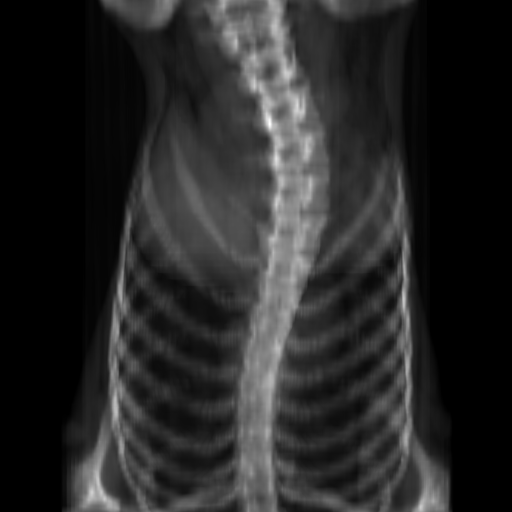
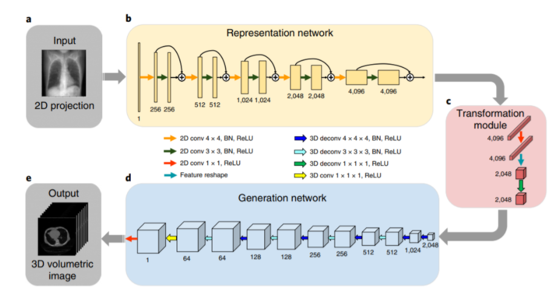

# 用单张X光进行CT的三维重建

## 一、课题背景

【前言-废话】

​	这个项目呢是我在研一开学前假期在实验室和师兄学习的一个项目。研一第一个学期的学习生活已经结束啦，然后发现之前做过的好多项目都忘记了。在学习期间也有好多人在[**CSDN**](https://blog.csdn.net/weixin_40977054/article/details/107460019)上问我该课题相关的一些技术细节，然后我由于当时上课的确太忙了也没回复。刚好假期期间就重新的好好整理一遍这个项目~

【注意】

此次readme中更新的部分代码可能项目中没有，因为我已经在readme上放了完整代码啦，所以直接复制就可以跑啦~

### 1.1 背景

X光是一种常用的无痛快速的医学成像手段。X光的原理是在做X光检查的过程中，患者体内不同组织吸收X光的速率是不同的，在X光检查过程中，电磁波通过患者并以不同的速率被吸收，将患者体积的放射密度投影到曝光的照相胶片上，从而生成2D图像。

CT成像基本原理是用X线束对人体检查部位一定厚度的层面进行扫描，简单来说CT就是扫描人体产生多个切片，然后通过对切片信息重构就可以得到人体的详细三维信息。CT虽然能提供详细的三维信息，但是会带来额外的金钱和安全成本。CT成像比照单张X光更昂贵，而且如果会让患者暴露在一个数量级水平更高的辐射中。所以一般在临床医疗中，医生X光会比CT更为普变。

当医生拿到一张二维的X光的时候，医生是可以根据先验知识来理解二维平面X光片中的三维结构的。所以在人类领域通过足够的先验知识，是可以从二维的X光理解得到三维的人体结构的。所以此个课题项目就是希望通过二维的X光图像就可以重建出三维的脊柱骨模型，在空间上获取更多的数据，更好地对脊柱骨的侧弯程度进行分型。

### 1.2 前期论文研读

- 脊柱侧弯背景知识

  - 阅读了Lenke分型的论文，掌握基本的脊柱分型知识

- STATE OF THE ART 三维重建

  - [**Yoni Kasten et al (2020)**](https://arxiv.org/abs/2004.00871) 等人提出的端对端的利用双平面X-Ray图像重建三维模型的方法
  - [**Liyue Shen et al**](https://www.nature.com/articles/s41551-019-0466-4) 等人提出的通过单个DRR图像生成CT数据的
  - [**Henzler et al. (2018)**](https://www.google.com/url?q=https%3A%2F%2Farxiv.org%2Fpdf%2F1710.04867.pdf&sa=D&sntz=1&usg=AFQjCNHYrFtDXoFNmJyo7xS8sritQYs3Wg)提出的利用一个 encoder-decoder structure的卷积神经网络对实现2D到3D的重建

- STATE OF THE ART 合成X光

  由于通过X光生成CT需要成对的X光和CT数据，然而由于隐私政策等多重因素，实际上我们是很难获取如此多的数据的，所以打算在数据准备这块打算用CT数据生成X光来产生3D-2D配对的数据对。

  - [**Moturu and Chang (2019)**](https://www.google.com/url?q=https%3A%2F%2Fwww.semanticscholar.org%2Fpaper%2FCreation-of-Synthetic-X-Rays-to-Train-a-Neural-to-Moturu-Chang%2F21b248300369c372457b025bfe44ee7f6382aacd&sa=D&sntz=1&usg=AFQjCNEsfvYw1_U0SSv0MvWc3KJrQvp1jg) 提处了一种使用ray-tracing和Beer's Law的从胸部CT扫描切片种合成X光的方法
  - [**Teixeira et al.**](https://www.google.com/url?q=https%3A%2F%2Farxiv.org%2Fpdf%2F1805.00553.pdf&sa=D&sntz=1&usg=AFQjCNH_VJYRoTklX8yq4q0tC2i2T_xevg) (2018)提出了一种合成X光图像的框架，该框架基于胸腔和腹部的表面几何形状来合成X光


## 二、实验部分前期准备

### 2.1 数据准备部分

为了创建一个可以接收2D-X光图像作为输入并产生3D-CT输出的神经网络，训练数据集必须由成对的2D-3D数据组成。我们课题组有和医院合作来获取数据集，不过在实际的实验过程中医院的数据量是远远不够的。因此我们想利用生成二维X光图像的方法来获取大量的2D-3D配对的数据集。CT数据集选用了公开的肺部数据集 [**The Cancer Imaging Archive (TCIA)**](https://www.google.com/url?q=https%3A%2F%2Fwiki.cancerimagingarchive.net%2Fdisplay%2FPublic%2FLIDC-IDRI&sa=D&sntz=1&usg=AFQjCNFgOn4TZr56GEc_Lejv8VHF8-zwiA)

### 2.2 对CT数据进行数据处理

从官网下下来的肺部数据集分布比较零散,数据有的存在一级目录下，有的存在二级目录下。所以首先要先从原始的数据中找出所有的CT序列，并存入新的文件夹中

```python
# 从原始数据中找出所有的CT序列，并存入新的文件夹
import os
import csv
import shutil
from tqdm import tqdm

data_dir = "D:\\lung_public_dataset\\LIDC-IDRI"
output_dir = "D:\\lung_public_dataset\\Raw_data"
csv_path = "D:\\lung_public_dataset\\data.csv"

if not os.path.exists(output_dir):
    os.mkdir(output_dir)

data_list = []
with open(csv_path, 'w', newline="") as f:
    writer = csv.writer(f)
    for maindir, subdir, file_name_list in os.walk(data_dir):
        if len(file_name_list) > 50:
            data_list.append(maindir)
print(os.listdir(data_list[0]))

file_count = 0
for item in tqdm(data_list):
    file_dir = output_dir + "\\" + str(file_count)
    shutil.copytree(item, file_dir, ignore=shutil.ignore_patterns('*.xml'))
    file_count += 1

```

经过这个脚本之后，所有的数据就会被规整的放到Raw_data文件夹下，提取到了1013个样本。此时每一个文件夹下都已一些列的.dcm切片，但是此时这些切片都是不规整的，有些文件夹下切片比较多，有些比较少。需要进一步将所有的切片都变为一个正方体，即如果切片数过多的进行裁剪，舍弃一部分切片。如果切片数不够的，则在首尾补全黑色切片。并将最后整理得到的CT数据转化为.nii的三维数据类型进行保存。保存到ct_nii文件路径下

```python
import numpy as np
from scipy.ndimage import zoom
import SimpleITK as sitk
import pydicom
import os
import dicom2nifti.patch_pydicom_encodings
from tqdm import tqdm
import csv

raw_ct_dir = "D:\\lung_public_dataset\\Raw_data\\"
raw_list = os.listdir(raw_ct_dir)
output = "D:\\lung_public_dataset\\ct_nii\\"


# resample to 128*128
def ImageResampleSize(sitk_image, img_size=128, is_label=False):
    # 获取原来CT的Size和Spacing
    size = np.array(sitk_image.GetSize())
    spacing = np.array(sitk_image.GetSpacing())

    new_size = (img_size, img_size, size[2])
    new_spacing_refine = size * spacing / new_size
    new_spacing_refine = [float(s) for s in new_spacing_refine]
    new_size = [int(s) for s in new_size]

    resample = sitk.ResampleImageFilter()
    resample.SetOutputDirection(sitk_image.GetDirection())
    resample.SetOutputOrigin(sitk_image.GetOrigin())
    resample.SetSize(new_size)
    resample.SetOutputSpacing(new_spacing_refine)

    if is_label:
        resample.SetInterpolator(sitk.sitkNearestNeighbor)
    else:
        # resample.SetInterpolator(sitk.sitkBSpline)
        resample.SetInterpolator(sitk.sitkLinear)
    newimage = resample.Execute(sitk_image)
    return newimage


def saved_preprocessed(savedImg, origin, direction, xyz_thickness):
    newImg = sitk.GetImageFromArray(savedImg)
    newImg.SetOrigin(origin)
    newImg.SetDirection(direction)
    newImg.SetSpacing((xyz_thickness[0], xyz_thickness[1], xyz_thickness[2]))
    return newImg


f = open('D:\\lung_public_dataset\\img_info.csv', 'w', encoding='utf-8', newline='')
csv_writer = csv.writer(f)
csv_writer.writerow(
    ["file_name", "origin_spacing", "origin_Origin", "origin_Direction", "origin_Size",
     "resize_spacing", "resize_Origin", "resize_Direction", "resize_Size"])
for file in tqdm(raw_list):
    # 读取dicom序列
    file_path = os.path.join(raw_ct_dir, file)
    output_path = output + file + ".nii"

    reader = sitk.ImageSeriesReader()
    reader.MetaDataDictionaryArrayUpdateOn()  # 这一步是加载公开的元信息
    reader.LoadPrivateTagsOn()  # 这一步是加载私有的元信息
    img_names = reader.GetGDCMSeriesFileNames(file_path)

    reader.SetFileNames(img_names)
    image = reader.Execute()
    # 原来的info
    origin_spacing = image.GetSpacing()
    origin_Origin = image.GetOrigin()
    origin_Direction = image.GetDirection()
    origin_Size = image.GetSize()

    normal = ImageResampleSize(image)
    # resize后的Info
    resize_spacing = normal.GetSpacing()
    resize_Origin = normal.GetOrigin()
    resize_Direction = normal.GetDirection()
    resize_Size = normal.GetSize()

    # 写入信息
    csv_writer.writerow([file, origin_spacing, origin_Origin, origin_Direction, origin_Size, resize_spacing,
                         resize_Origin, resize_Direction, resize_Size])

    # 获取CT_array
    np_arr = sitk.GetArrayFromImage(normal)
    # 去除CT边界图像
    np_arr[np_arr < -500] = -500
    # 将CT修正为128*128*128
    x, y, z = np_arr.shape
    if z < x or z < y:
        startx = (x - z) // 2
        starty = (y - z) // 2
        # 裁剪成一个正方体
        cubed_arr = np_arr[startx:startx + z, starty:starty + z, :]
    else:
        max_xyz = max(x, y, z)
        x_pre_pad = (max_xyz - x) // 2
        # (8-6)//2=1
        x_post_pad = max_xyz - x - x_pre_pad
        # 8-6-1=1
        y_pre_pad = (max_xyz - y) // 2
        y_post_pad = max_xyz - y - y_pre_pad
        # 填充成一个正方体
        cubed_arr = np.pad(np_arr, ((x_pre_pad, x_post_pad), (y_pre_pad, y_post_pad), (0, 0)), mode='constant',
                           constant_values=0)
    print("process-2: resize to cube !  ", cubed_arr.shape)

    x1, y1, z1 = cubed_arr.shape
    assert x1 == y1, 'x and y dimensions are the same size'
    assert y1 == z1, 'y and z dimensions are the same size'
    assert z1 == x1, 'z and x dimensions are the same size'

    # resize_img = sitk.GetImageFromArray(cubed_arr)
    resize_img = saved_preprocessed(cubed_arr, resize_Origin, resize_Direction, resize_spacing)
    print(resize_img.GetSize())
    sitk.WriteImage(resize_img, output_path)

```

### 2.3 生成DRR来作为2D的X光

#### 2.3.1 DRR介绍

DRR图像时医疗图像配准里面的一个重要的前置步骤：它的主要目的是，通过CT三维图像，获取模拟X射线影像,这个过程也被称为数字影像重建。在2D/3D的配准流程里面，需要首先通过CT三维图像，能够获取任意位置的DRR图像，然后去与已经获取的X光平面图像配准。正如前面所说的论文前期准备一样，用CT模拟生成X光的论文有很多。然后此次课题主要的重点时进行三维重建，所以这部分直接选用了ITK的一个相关示例进行DRR投影。这一部分网上的资料比较少，然后本人对DRR投影的原理其实并不是特别了解，所以花费了比较多的时间才跑通。然后下面时实验所用代码。【注意】需要在C++环境下运行

#### 2.3.2 DRR代码即结果

- 这个代码的输入为CT的.nii格式；中间部分的注释为原来用.dicom作为输入。

- 这个代码主要也是基于官方示例教程进行更改的，所以很多地方也并没有十分看懂，但是主要需要调参的地方以及参数意义在代码中已经有注释了。

> 生成结果示例：好像是倒过来的不过其实并不影响训练：
>
> 

```c++
#include "itkImage.h"
#include "itkImageFileReader.h"
#include "itkImageFileWriter.h"
#include "itkResampleImageFilter.h"
#include "itkCenteredEuler3DTransform.h"
#include "itkNearestNeighborInterpolateImageFunction.h"
#include "itkImageRegionIteratorWithIndex.h"
#include "itkRescaleIntensityImageFilter.h"
#include <itkGDCMImageIO.h>
#include <itkPNGImageIO.h>
#include "itkPNGImageIOFactory.h"
#include "itkGDCMSeriesFileNames.h"
#include "itkImageSeriesReader.h"
#include "itkImageSeriesWriter.h"
#include "itkNumericSeriesFileNames.h"
#include "itkGiplImageIOFactory.h"
#include "itkCastImageFilter.h"
#include "itkNIFTIImageIO.h"
#include "itkNIFTIImageIOFactory.h"
#include "itkMetaImageIOFactory.h"
#pragma comment(lib,"ws2_32.lib")
#pragma comment(lib,"Rpcrt4.lib")
#pragma  once
#pragma  comment(lib,"Psapi.lib")
// Software Guide : BeginCodeSnippet
#include "itkRayCastInterpolateImageFunction.h"
#include <iostream>
// Software Guide : EndCodeSnippet
#include <io.h>
#include<iostream>
using namespace std;

int main(int argc, char* argv[])
{
	int file_list[1013];
	for (int i = 0; i < 1013; i++) {
		file_list[i] = i;
		//cout << i << endl;
	}
	// 总共1013个文件，然后懒得大改代码了。如果文件数有不同记得根据自己的文件进行修改
    // 输出的文件会保存在文件下为drr文件夹下，为.png数据类型
	for (int i = 0; i < 1013; i++) {
		int number = file_list[i];
		string num = to_string(number);

		string in_drr = "D:/7_15data/open_dataset/ct_nii/";
		string out_drr = "D:/7_15data/open_dataset/drr/";

		string input = in_drr + num;
		string output = out_drr + num + ".png";

		const char* input_name = input.c_str();
		const char* output_name = output.c_str();
		cout << input_name << endl;
		//cout << output_name << endl;

		//const char* input_name = "D:/7_15data/ct/1 ";
		//const char* output_name = "D:/7_15data/drr/5.png";
		
		bool ok ;  //true
		bool verbose = false; //true
		
			// CT volume rotation around isocenter along x,y,z axis in degrees
		float rx = 90;
		float ry = 0;
		//float rz = 30.; //角度调节
		//float rz = -90.;//侧着的
		float rz = 0.; //正着的
		//float rz = 180.; //背面
		
		// Translation parameter of the isocenter in mm
		float tx = 0.;
		float ty = 0.;
		float tz = 0.;
		
		// The pixel indices of the isocenter
		// The pixel indices of the isocenter
		float cx = 0.;
		float cy = 0.;
		float cz = 0.;
		//1000.
		//float sid = 3000; //400. Source to isocenter distance in mm 源到等中心距 1000
		float sid = 500; //400. Source to isocenter distance in mm 源到等中心距 1000
		
		//Default pixel spacing in the iso-center plane in mm
		//等角点平面中的默认像素间距，以毫米为单位
		//float sx = 2.5; //1.  2,5
		//float sy = 0.5; //1.
		float sx = 2.5; //1.
		float sy = 2.5; //1.
		
		// Size of the output image in number of pixels
		int dx = 512;
		int dy = 512;
		
		// The central axis positions of the 2D images in continuous indices
		//连续索引中2D图像的中心轴位置
		float o2Dx = 0;
		float o2Dy = 0;
		
		double threshold = -600; //1
		
		
		const     unsigned int   Dimension = 3;
		
		typedef  float    InputPixelType;
		typedef  unsigned char  OutputPixelType;
		
		
		typedef itk::Image< InputPixelType, Dimension >   InputImageType;
		typedef itk::Image< OutputPixelType, Dimension >   OutputImageType;
		//设置输出类型
		
		InputImageType::Pointer image;
		
		
		if (input_name)
		{
			//typedef itk::ImageSeriesReader< InputImageType >     ReaderType;
			//typedef itk::GDCMImageIO                        ImageIOType;
			//typedef itk::GDCMSeriesFileNames                NamesGeneratorType;
			//ImageIOType::Pointer gdcmIO = ImageIOType::New();
		
			//NamesGeneratorType::Pointer namesGenerator = NamesGeneratorType::New();
			//namesGenerator->SetUseSeriesDetails(true);
		
			//namesGenerator->SetDirectory("D:/7_9data/compress_ct/11");
			////namesGenerator->SetDirectory("D:/7_9data/volume-0.nii");
			//using SeriesIdContainer = std::vector< std::string >;
			//const SeriesIdContainer& seriesUID = namesGenerator->GetSeriesUIDs();
			//auto seriesItr = seriesUID.begin();
			//auto seriesEnd = seriesUID.end();
			//using FileNamesContainer = std::vector< std::string >;
			//FileNamesContainer filenames;
			//std::string seriesIdentifier;
			//while (seriesItr != seriesEnd)
			//{
			//	seriesIdentifier = seriesItr->c_str();
			//	filenames = namesGenerator->GetFileNames(seriesIdentifier);
			//	++seriesItr;
			//}
			////namesGenerator->SetInputDirectory("D:/data/CT/PATIENT_DICOM/PATIENT_DICOM1");    //输入目录
			////const ReaderType::FileNamesContainer& filenames =
			//	//namesGenerator->GetInputFileNames();
		
			//unsigned int numberOfFilenames = filenames.size();
			//std::cout << numberOfFilenames << std::endl;
			//for (unsigned int fni = 0; fni < numberOfFilenames; fni++)
			//{
			//	std::cout << "filename # " << fni << " = ";
			//	std::cout << filenames[fni] << std::endl;
			//}
			//ReaderType::Pointer reader = ReaderType::New();
			//reader->SetImageIO(gdcmIO);
			//reader->SetFileNames(filenames);
		
		/*	typedef itk::ImageFileReader< InputImageType >  ReaderType;
			ReaderType::Pointer reader = ReaderType::New();
			itk::MetaImageIOFactory::RegisterOneFactory();
			reader->SetFileName("D:/7_9data/volume-0.nii");*/
		
			
			typedef itk::ImageFileReader< InputImageType >  ReaderType;
			ReaderType::Pointer reader = ReaderType::New();
			itk::NiftiImageIOFactory::RegisterOneFactory();
			reader->SetFileName(input_name);
		
			
		
			try
			{
				reader->Update();
			}
			catch (itk::ExceptionObject& err)
			{
				std::cerr << "ERROR: ExceptionObject caught !" << std::endl;
				std::cerr << err << std::endl;
				return EXIT_FAILURE;
			}
		
			image = reader->GetOutput();
		
		}
		else
		{   // No input image specified so create a cube
		
			image = InputImageType::New();
		
			InputImageType::SpacingType spacing;
			spacing[0] = 3.;
			spacing[1] = 3.;
			spacing[2] = 3.;
			image->SetSpacing(spacing);
		
			InputImageType::PointType origin;
			origin[0] = 0.;
			origin[1] = 0.;
			origin[2] = 0.;
			image->SetOrigin(origin);
		
			InputImageType::IndexType start;
		
			start[0] = 0;  // first index on X
			start[1] = 0;  // first index on Y
			start[2] = 0;  // first index on Z
		
			InputImageType::SizeType  size;
		
			size[0] = 61;  // size along X
			size[1] = 61;  // size along Y
			size[2] = 61;  // size along Z
		
			InputImageType::RegionType region;
		
			region.SetSize(size);
			region.SetIndex(start);
		
			image->SetRegions(region);
			image->Allocate(true); // initialize to zero.
		
			image->Update();
		
			typedef itk::ImageRegionIteratorWithIndex< InputImageType > IteratorType;
		
			IteratorType iterate(image, image->GetLargestPossibleRegion());
		
			while (!iterate.IsAtEnd())
			{
		
				InputImageType::IndexType idx = iterate.GetIndex();
		
				if ((idx[0] >= 6) && (idx[0] <= 54)
					&& (idx[1] >= 6) && (idx[1] <= 54)
					&& (idx[2] >= 6) && (idx[2] <= 54)
		
					&& ((((idx[0] <= 11) || (idx[0] >= 49))
						&& ((idx[1] <= 11) || (idx[1] >= 49)))
		
						|| (((idx[0] <= 11) || (idx[0] >= 49))
							&& ((idx[2] <= 11) || (idx[2] >= 49)))
		
						|| (((idx[1] <= 11) || (idx[1] >= 49))
							&& ((idx[2] <= 11) || (idx[2] >= 49)))))
				{
					iterate.Set(10);
				}
		
				else if ((idx[0] >= 18) && (idx[0] <= 42)
					&& (idx[1] >= 18) && (idx[1] <= 42)
					&& (idx[2] >= 18) && (idx[2] <= 42)
		
					&& ((((idx[0] <= 23) || (idx[0] >= 37))
						&& ((idx[1] <= 23) || (idx[1] >= 37)))
		
						|| (((idx[0] <= 23) || (idx[0] >= 37))
							&& ((idx[2] <= 23) || (idx[2] >= 37)))
		
						|| (((idx[1] <= 23) || (idx[1] >= 37))
							&& ((idx[2] <= 23) || (idx[2] >= 37)))))
				{
					iterate.Set(60);
				}
		
				else if ((idx[0] == 30) && (idx[1] == 30) && (idx[2] == 30))
				{
					iterate.Set(100);
				}
		
				++iterate;
			}
		
		
	#ifdef WRITE_CUBE_IMAGE_TO_FILE
			const char* filename = "cube.gipl";
			typedef itk::ImageFileWriter< InputImageType >  WriterType;
			WriterType::Pointer writer = WriterType::New();
			itk::GiplImageIOFactory::RegisterOneFactory();
			writer->SetFileName(filename);
			writer->SetInput(image);
		
			try
			{
				std::cout << "Writing image: " << filename << std::endl;
				writer->Update();
			}
			catch (itk::ExceptionObject& err)
			{
		
				std::cerr << "ERROR: ExceptionObject caught !" << std::endl;
				std::cerr << err << std::endl;
				return EXIT_FAILURE;
			}
	#endif
		}
		
		
		// Print out the details of the input volume
		
		if (verbose)
		{
			unsigned int i;
			const InputImageType::SpacingType spacing = image->GetSpacing();
			std::cout << std::endl << "Input ";
		
			InputImageType::RegionType region = image->GetBufferedRegion();
			region.Print(std::cout);
		
			std::cout << "  Resolution: [";
			for (i = 0; i < Dimension; i++)
			{
				std::cout << spacing[i];
				if (i < Dimension - 1) std::cout << ", ";
			}
			std::cout << "]" << std::endl;
		
			const InputImageType::PointType origin = image->GetOrigin();
			std::cout << "  Origin: [";
			for (i = 0; i < Dimension; i++)
			{
				std::cout << origin[i];
				if (i < Dimension - 1) std::cout << ", ";
			}
			std::cout << "]" << std::endl << std::endl;
		}
		
		typedef itk::ResampleImageFilter<InputImageType, InputImageType > FilterType;
		
		FilterType::Pointer filter = FilterType::New();
		
		filter->SetInput(image);
		filter->SetDefaultPixelValue(0);
		
		typedef itk::CenteredEuler3DTransform< double >  TransformType;
		
		TransformType::Pointer transform = TransformType::New();
		
		transform->SetComputeZYX(true);
		
		TransformType::OutputVectorType translation;
		
		translation[0] = tx;
		translation[1] = ty;
		translation[2] = tz;
		
		// constant for converting degrees into radians
		const double dtr = (std::atan(1.0) * 4.0) / 180.0;
		
		transform->SetTranslation(translation);
		transform->SetRotation(dtr * rx, dtr * ry, dtr * rz);
		
		InputImageType::PointType   imOrigin = image->GetOrigin();
		InputImageType::SpacingType imRes = image->GetSpacing();
		
		typedef InputImageType::RegionType     InputImageRegionType;
		typedef InputImageRegionType::SizeType InputImageSizeType;
		
		InputImageRegionType imRegion = image->GetBufferedRegion();
		InputImageSizeType   imSize = imRegion.GetSize();
		
		imOrigin[0] += imRes[0] * static_cast<double>(imSize[0]) / 2.0;
		imOrigin[1] += imRes[1] * static_cast<double>(imSize[1]) / 2.0;
		imOrigin[2] += imRes[2] * static_cast<double>(imSize[2]) / 2.0;
		
		TransformType::InputPointType center;
		center[0] = cx + imOrigin[0];
		center[1] = cy + imOrigin[1];
		center[2] = cz + imOrigin[2];
		
		transform->SetCenter(center);
		
		if (verbose)
		{
			std::cout << "Image size: "
				<< imSize[0] << ", " << imSize[1] << ", " << imSize[2]
				<< std::endl << "   resolution: "
				<< imRes[0] << ", " << imRes[1] << ", " << imRes[2]
				<< std::endl << "   origin: "
				<< imOrigin[0] << ", " << imOrigin[1] << ", " << imOrigin[2]
				<< std::endl << "   center: "
				<< center[0] << ", " << center[1] << ", " << center[2]
				<< std::endl << "Transform: " << transform << std::endl;
		}
		
		typedef itk::RayCastInterpolateImageFunction<InputImageType, double>
			InterpolatorType;
		InterpolatorType::Pointer interpolator = InterpolatorType::New();
		interpolator->SetTransform(transform);
		
		//
		// We can then specify a threshold above which the volume's
		// intensities will be integrated.
		
		interpolator->SetThreshold(threshold);
		
		InterpolatorType::InputPointType focalpoint;
		
		focalpoint[0] = imOrigin[0];
		focalpoint[1] = imOrigin[1];
		focalpoint[2] = imOrigin[2] - sid / 2.;
		
		interpolator->SetFocalPoint(focalpoint);
		// Software Guide : EndCodeSnippet
		
		if (verbose)
		{
			std::cout << "Focal Point: "
				<< focalpoint[0] << ", "
				<< focalpoint[1] << ", "
				<< focalpoint[2] << std::endl;
		}
		
		// Software Guide : BeginLatex
		//
		// Having initialised the interpolator we pass the object to the
		// resample filter.
		
		interpolator->Print(std::cout);
		
		filter->SetInterpolator(interpolator);
		filter->SetTransform(transform);
		
		
		// setup the scene
		InputImageType::SizeType   size;
		
		size[0] = dx;  // number of pixels along X of the 2D DRR image
		size[1] = dy;  // number of pixels along Y of the 2D DRR image
		size[2] = 1;   // only one slice
		
		filter->SetSize(size);
		
		InputImageType::SpacingType spacing;
		
		spacing[0] = sx;  // pixel spacing along X of the 2D DRR image [mm]
		spacing[1] = sy;  // pixel spacing along Y of the 2D DRR image [mm]
		spacing[2] = 1.0; // slice thickness of the 2D DRR image [mm]
		
		filter->SetOutputSpacing(spacing);
		
		// Software Guide : EndCodeSnippet
		
		if (verbose)
		{
			std::cout << "Output image size: "
				<< size[0] << ", "
				<< size[1] << ", "
				<< size[2] << std::endl;
		
			std::cout << "Output image spacing: "
				<< spacing[0] << ", "
				<< spacing[1] << ", "
				<< spacing[2] << std::endl;
		}
		
		
		
		double origin[Dimension];
		
		origin[0] = imOrigin[0] + o2Dx - sx * ((double)dx - 1.) / 2.;
		origin[1] = imOrigin[1] + o2Dy - sy * ((double)dy - 1.) / 2.;
		origin[2] = imOrigin[2] + sid / 2.;
		
		filter->SetOutputOrigin(origin);
		// Software Guide : EndCodeSnippet
		
		if (verbose)
		{
			std::cout << "Output image origin: "
				<< origin[0] << ", "
				<< origin[1] << ", "
				<< origin[2] << std::endl;
		}
		
		// create writer
		
		if (output_name)
		{
		
			typedef itk::RescaleIntensityImageFilter<
				InputImageType, OutputImageType > RescaleFilterType;
			RescaleFilterType::Pointer rescaler = RescaleFilterType::New();
			rescaler->SetOutputMinimum(0);
			rescaler->SetOutputMaximum(255);
			rescaler->SetInput(filter->GetOutput());
			//
			typedef itk::ImageFileWriter< OutputImageType >  WriterType;
			WriterType::Pointer writer = WriterType::New();
		
			typedef itk::PNGImageIO pngType;
			pngType::Pointer pngIO1 = pngType::New();
			itk::PNGImageIOFactory::RegisterOneFactory();
			writer->SetFileName(output_name);
			writer->SetImageIO(pngIO1);
			writer->SetImageIO(itk::PNGImageIO::New());
			writer->SetInput(rescaler->GetOutput());
		
			try
			{
				std::cout << "Writing image: " << output_name << std::endl;
				writer->Update();
			}
			catch (itk::ExceptionObject& err)
			{
				std::cerr << "ERROR: ExceptionObject caught !" << std::endl;
				std::cerr << err << std::endl;
			}
		
		}
		else
		{
			filter->Update();
		}
	/*	system("pause");
		return EXIT_SUCCESS;*/

		
	}
}

```

### 2.4 数据扩增

其实1000多个数据集还是不是很够的，所以这里进行了数据扩增。但是这一步怎么说呢比较微妙，感觉并不是特别的好。所以数据量足够的情况下不建议加这步。

三维重建的思想是想让模型观测一张二维的X光能生成对应的三维模型。实际上我们并不关心看到的这张图像的角度是什么样的，也不关心这张图想的颜色强度是怎样的（对应窗宽等概念），所以是否可以将X光旋转然后进行明暗变化，然后让模型学到其本质之下的特征所对应的三维关系是一样的呢？所以本着这样的假设，可以将我们人造的X光图像进行一定程度上的旋转，颜色明暗程度的变化，然后这些变化后的图像仍然对应原来的三维模型。这里只是实验，可能并不严谨，勿杠 [狗头保命]

这个地方思路简单就不放代码啦，数据扩增脚本很多的~

### 2.5 注意事项

在这个地方有一个地方没做好，就是没有将CT的体素规整到1：1：1，而是将每个体素的spacing保存下来了。因为这个是公开数据集，所以是不同CT仪器的数据，每一个CT的spacing都是不一样的。所以又要将它变为正方体，又要让他的间隔距离变为1：1：1当时时间紧迫就没有这样做了。而是实现将所有的spacing信息都保存了下来。这个地方就是有bug，假期刚接受的小白新手，真诚的希望大神指点！[保护好我的狗头发际线.jpg]


## 三、网络部分

### 3.1 基本思路

网络这部分我在[**Liyue Shen et al**](https://www.nature.com/articles/s41551-019-0466-4) 等人提出网络上进行了一些改进，然后由于这部分关乎到我师兄最后的论文部分，所以感觉不太好开源。所以这部分我简要的叙述一下我的思路：



其实这篇论文的网络结构并不是特别复杂，主要分为三个模块：表征网络、转换模块、生成网络。

- 表征层网络在原论文中用到的是一个类残差网络的结构，主要用于提取DRR图像的特征信息
  - 在后面的实际测试中，我发现Liyue Shen在表征层的前几层就用了将卷积核的数目设得特别大，这样直接导致表征层的计算参数非常的多！ 甚至表征层部分的计算参数比resnet-50还要多。这样网络训练起来是非常慢且很难收敛。所以表征层部分的网络是明显可以优化的！
  - 虽然原论文说，这样做能尽可能的保留较多的信息，但是实际训练中可以发现过大的计算量反而不利于网络的训练
- 转化模块
  - 经过表征层网络训练后得到4096×4×4的tensor,通过transform模块将这个tensor转为2048×2×4×4
  - 实现起来其实很简单就是一个tensor的转化
- 生成网络
  - 类似一个解码器，根据二维图像提取的特征生成三维的CT数据
  - 生成网络比较简单，是否可以优化生成部分的网络结构（感觉只是单纯的为了将特征还原到CT的数据大小）
  - 其实也有点像GAN，将得到的特征生成三维信息（仅个人感觉）

### 3.2 原论文代码

以下是[**Liyue Shen et al**](https://www.nature.com/articles/s41551-019-0466-4)开源的代码，我稍作了改写方便调试运行

```python
import torch.nn as nn
import torch
import math
from torch.nn import init
from torchsummary import summary


# 2D Conv
def conv1x1(in_planes, out_planes, stride=1):
    return nn.Conv2d(in_planes, out_planes,
                     kernel_size=1, stride=stride, padding=0,
                     bias=False)


def conv2x2(in_planes, out_planes, stride=2):
    return nn.Conv2d(in_planes, out_planes,
                     kernel_size=2, stride=stride, padding=0,
                     bias=False)


def conv3x3(in_planes, out_planes, stride=1):
    return nn.Conv2d(in_planes, out_planes,
                     kernel_size=3, stride=stride, padding=1,
                     bias=False)


def conv4x4(in_planes, out_planes, stride=2):
    return nn.Conv2d(in_planes, out_planes,
                     kernel_size=4, stride=stride, padding=1,
                     bias=False)


# 3D Conv
def conv1x1x1(in_planes, out_planes, stride=1):
    return nn.Conv3d(in_planes, out_planes,
                     kernel_size=1, stride=stride, padding=0,
                     bias=False)


def conv3x3x3(in_planes, out_planes, stride=1):
    return nn.Conv3d(in_planes, out_planes,
                     kernel_size=3, stride=stride, padding=1,
                     bias=False)


def conv4x4x4(in_planes, out_planes, stride=2):
    return nn.Conv3d(in_planes, out_planes,
                     kernel_size=4, stride=stride, padding=1,
                     bias=False)


# 2D Deconv
def deconv1x1(in_planes, out_planes, stride):
    return nn.ConvTranspose2d(in_planes, out_planes,
                              kernel_size=1, stride=stride, padding=0, output_padding=0,
                              bias=False)


def deconv2x2(in_planes, out_planes, stride):
    return nn.ConvTranspose2d(in_planes, out_planes,
                              kernel_size=2, stride=stride, padding=0, output_padding=0,
                              bias=False)


def deconv3x3(in_planes, out_planes, stride):
    return nn.ConvTranspose2d(in_planes, out_planes,
                              kernel_size=3, stride=stride, padding=1, output_padding=0,
                              bias=False)


def deconv4x4(in_planes, out_planes, stride):
    return nn.ConvTranspose2d(in_planes, out_planes,
                              kernel_size=4, stride=stride, padding=1, output_padding=0,
                              bias=False)


# 3D Deconv
def deconv1x1x1(in_planes, out_planes, stride):
    return nn.ConvTranspose3d(in_planes, out_planes,
                              kernel_size=1, stride=stride, padding=0, output_padding=0,
                              bias=False)


def deconv3x3x3(in_planes, out_planes, stride):
    return nn.ConvTranspose3d(in_planes, out_planes,
                              kernel_size=3, stride=stride, padding=1, output_padding=0,
                              bias=False)


def deconv4x4x4(in_planes, out_planes, stride):
    return nn.ConvTranspose3d(in_planes, out_planes,
                              kernel_size=4, stride=stride, padding=1, output_padding=0,
                              bias=False)


def _make_layers(in_channels, output_channels, type, batch_norm=False, activation=None):
    layers = []

    if type == 'conv1_s1':
        layers.append(conv1x1(in_channels, output_channels, stride=1))
    elif type == 'conv2_s2':
        layers.append(conv2x2(in_channels, output_channels, stride=2))
    elif type == 'conv3_s1':
        layers.append(conv3x3(in_channels, output_channels, stride=1))
    elif type == 'conv4_s2':
        layers.append(conv4x4(in_channels, output_channels, stride=2))
    elif type == 'deconv1_s1':
        layers.append(deconv1x1(in_channels, output_channels, stride=1))
    elif type == 'deconv2_s2':
        layers.append(deconv2x2(in_channels, output_channels, stride=2))
    elif type == 'deconv3_s1':
        layers.append(deconv3x3(in_channels, output_channels, stride=1))
    elif type == 'deconv4_s2':
        layers.append(deconv4x4(in_channels, output_channels, stride=2))
    elif type == 'conv1x1_s1':
        layers.append(conv1x1x1(in_channels, output_channels, stride=1))
    elif type == 'deconv1x1_s1':
        layers.append(deconv1x1x1(in_channels, output_channels, stride=1))
    elif type == 'deconv3x3_s1':
        layers.append(deconv3x3x3(in_channels, output_channels, stride=1))
    elif type == 'deconv4x4_s2':
        layers.append(deconv4x4x4(in_channels, output_channels, stride=2))
    else:
        raise NotImplementedError('layer type [{}] is not implemented'.format(type))

    if batch_norm == '2d':
        layers.append(nn.BatchNorm2d(output_channels))
    elif batch_norm == '3d':
        layers.append(nn.BatchNorm3d(output_channels))

    if activation == 'relu':
        layers.append(nn.ReLU(inplace=True))
    elif activation == 'sigm':
        layers.append(nn.Sigmoid())
    elif activation == 'leakyrelu':
        layers.append(nn.LeakyReLU(0.2, True))
    else:
        if activation is not None:
            raise NotImplementedError('activation function [{}] is not implemented'.format(activation))

    return nn.Sequential(*layers)


def _init_weights(net, init_type='normal', gain=0.02):
    def init_func(m):
        classname = m.__class__.__name__
        if hasattr(m, 'weight') and (classname.find('Conv') != -1 or classname.find('Linear') != -1):
            if init_type == 'normal':
                init.normal_(m.weight.data, 0.0, gain)
            elif init_type == 'xavier':
                init.xavier_normal_(m.weight.data, gain=1.0)
            elif init_stype == 'kaiming':
                init.kaiming_normal_(m.weight.data, a=0, mode='fan_in')
            elif init_type == 'orthogonal':
                init.orthogonal_(m.weight.data, gain=gain)
            else:
                raise NotImplementedError('initialization method [%s] is not implemented' % init_type)
            if hasattr(m, 'bias') and m.bias is not None:
                print('Initializing Weights: {}...'.format(classname))
                init.constant_(m.bias.data, 0.0)
        elif classname.find('BatchNorm2d') != -1:
            init.normal_(m.weight.data, 1.0, gain)
            init.constant_(m.bias.data, 0.0)
        elif classname.find('Sequential') == -1 and classname.find('Conv5_Deconv5_Local') == -1:
            raise NotImplementedError('initialization of [{}] is not implemented'.format(classname))

    print('initialize network with {}'.format(init_type))
    net.apply(init_func)


def _initialize_weights(net):
    for m in net.modules():
        if isinstance(m, nn.Conv2d) or isinstance(m, nn.ConvTranspose2d):
            n = m.kernel_size[0] * m.kernel_size[1] * m.out_channels
            m.weight.data.normal_(0, math.sqrt(2. / n))
            if m.bias is not None:
                m.bias.data.zero_()
        elif isinstance(m, nn.Conv3d) or isinstance(m, nn.ConvTranspose3d):
            n = m.kernel_size[0] * m.kernel_size[1] * m.kernel_size[2] * m.out_channels
            m.weight.data.normal_(0, math.sqrt(2. / n))
            if m.bias is not None:
                m.bias.data.zero_()
        elif isinstance(m, nn.BatchNorm2d) or isinstance(m, nn.BatchNorm3d):
            m.weight.data.fill_(1)
            m.bias.data.zero_()
        elif isinstance(m, nn.Linear):
            m.weight.data.normal_(0, 0.01)
            m.bias.data.zero_()


class ReconNet(nn.Module):

    def __init__(self, in_planes, out_planes, gain=0.02, init_type='standard'):
        super(ReconNet, self).__init__()

        ######### representation network - convolution layers
        self.conv_layer1 = _make_layers(in_planes, 256, 'conv4_s2', False)
        self.conv_layer2 = _make_layers(256, 256, 'conv3_s1', '2d')
        self.relu2 = nn.ReLU(inplace=True)
        self.conv_layer3 = _make_layers(256, 512, 'conv4_s2', '2d', 'relu')
        self.conv_layer4 = _make_layers(512, 512, 'conv3_s1', '2d')
        self.relu4 = nn.ReLU(inplace=True)
        self.conv_layer5 = _make_layers(512, 1024, 'conv4_s2', '2d', 'relu')
        self.conv_layer6 = _make_layers(1024, 1024, 'conv3_s1', '2d')
        self.relu6 = nn.ReLU(inplace=True)
        self.conv_layer7 = _make_layers(1024, 2048, 'conv4_s2', '2d', 'relu')
        self.conv_layer8 = _make_layers(2048, 2048, 'conv3_s1', '2d')
        self.relu8 = nn.ReLU(inplace=True)
        self.conv_layer9 = _make_layers(2048, 4096, 'conv4_s2', '2d', 'relu')
        self.conv_layer10 = _make_layers(4096, 4096, 'conv3_s1', '2d')
        self.relu10 = nn.ReLU(inplace=True)

        ######### transform module
        self.trans_layer1 = _make_layers(4096, 4096, 'conv1_s1', False, 'relu')
        self.trans_layer2 = _make_layers(2048, 2048, 'deconv1x1_s1', False, 'relu')

        ######### generation network - deconvolution layers
        self.deconv_layer10 = _make_layers(2048, 1024, 'deconv4x4_s2', '3d', 'relu')
        self.deconv_layer8 = _make_layers(1024, 512, 'deconv4x4_s2', '3d', 'relu')
        self.deconv_layer7 = _make_layers(512, 512, 'deconv3x3_s1', '3d', 'relu')
        self.deconv_layer6 = _make_layers(512, 256, 'deconv4x4_s2', '3d', 'relu')
        self.deconv_layer5 = _make_layers(256, 256, 'deconv3x3_s1', '3d', 'relu')
        self.deconv_layer4 = _make_layers(256, 128, 'deconv4x4_s2', '3d', 'relu')
        self.deconv_layer3 = _make_layers(128, 128, 'deconv3x3_s1', '3d', 'relu')
        self.deconv_layer2 = _make_layers(128, 64, 'deconv4x4_s2', '3d', 'relu')
        self.deconv_layer1 = _make_layers(64, 64, 'deconv3x3_s1', '3d', 'relu')
        self.deconv_layer0 = _make_layers(64, 1, 'conv1x1_s1', False, 'relu')
        self.output_layer = _make_layers(64, out_planes, 'conv1_s1', False)

        if init_type == 'standard':
            _initialize_weights(self)
        else:
            _init_weights(self, gain=gain, init_type=init_type)

    def forward(self, x):
        ### representation network
        conv1 = self.conv_layer1(x)
        conv2 = self.conv_layer2(conv1)
        relu2 = self.relu2(conv1 + conv2)
        conv3 = self.conv_layer3(relu2)
        conv4 = self.conv_layer4(conv3)
        relu4 = self.relu4(conv3 + conv4)
        conv5 = self.conv_layer5(relu4)
        conv6 = self.conv_layer6(conv5)
        relu6 = self.relu6(conv5 + conv6)
        conv7 = self.conv_layer7(relu6)
        conv8 = self.conv_layer8(conv7)
        relu8 = self.relu8(conv7 + conv8)
        conv9 = self.conv_layer9(relu8)
        conv10 = self.conv_layer10(conv9)
        relu10 = self.relu10(conv9 + conv10)

        ### transform module
        features = self.trans_layer1(relu10)
        trans_features = features.view(-1, 2048, 2, 4, 4)
        trans_features = self.trans_layer2(trans_features)

        ### generation network
        deconv10 = self.deconv_layer10(trans_features)
        deconv8 = self.deconv_layer8(deconv10)
        deconv7 = self.deconv_layer7(deconv8)
        deconv6 = self.deconv_layer6(deconv7)
        deconv5 = self.deconv_layer5(deconv6)
        deconv4 = self.deconv_layer4(deconv5)
        deconv3 = self.deconv_layer3(deconv4)
        deconv2 = self.deconv_layer2(deconv3)
        deconv1 = self.deconv_layer1(deconv2)

        ### output
        out = self.deconv_layer0(deconv1)
        out = torch.squeeze(out, 1)
        out = self.output_layer(out)

        return out


def reconnet(in_channels, out_channels, **kwargs):
    model = ReconNet(in_channels, out_channels, **kwargs)
    return model


model = reconnet(1, 128)
model.cuda()
summary(model, (1, 128, 128))
```

## 四、训练参数设置

个人训练设置：

- 激活函数选用ReLU

- 代价函数选用均方误差(MSE)

- 优化器论文中用了Adam

  - 实际用的时候使用Adam在反向传播的时候计算量很大，网络跑不动，所以使用了SGD,且momentum=0才跑得动

  - ```
    optimizer = torch.optim.SGD(model.parameters(), lr=0.001, momentum=0)
    ```

## 五、总结

这个项目我是大致都做完了，正如过程中所说还有挺多坑没填的，然后网络我是改了，效果也有明显提升。这里就不细说啦，等师兄的论文有结果在进一步总结。

有待填的坑：

- 数据处理部分的CT间距问题
- 设计新的损失函数
- 更好的DRR生成方法


