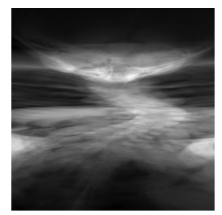
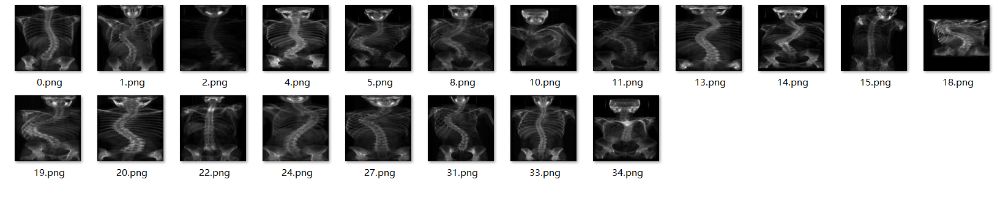
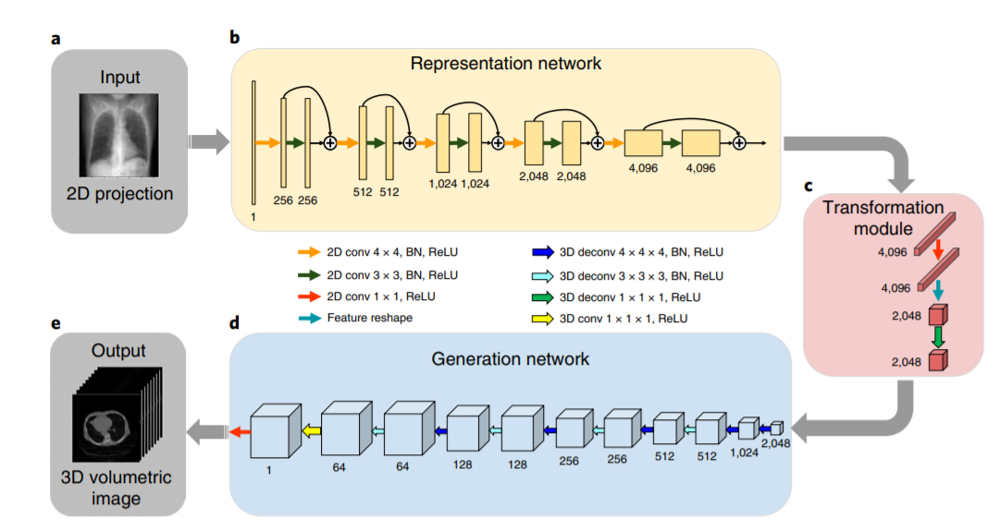
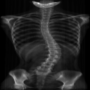
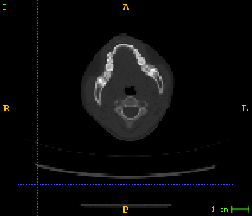
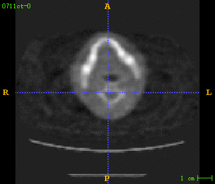
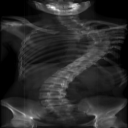
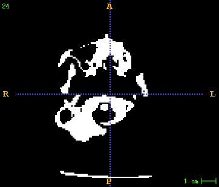

# 一、课题背景

希望通过二维的X光图像就可以重建出三维的脊柱骨模型，在空间上获取更多的数据，更好地对脊柱骨的侧弯程度进行分型。

## 1.1 前期论文研读

- 脊柱侧弯背景知识学习
  - 阅读了Lenke分型的论文，掌握基本的脊柱分型知识
- 三维重建
  - Yoni Kasten等人提出的端对端的利用双平面X-Ray图像重建三维模型的方法
  - **Liyue Shen等人提出的通过单个DRR图像生成CT数据的**
  - Henzler等人提出的利用一个 encoder-decoder structure的卷积神经网络对实现2D到3D的重建


# 二、三维重建的思路

## 2.1 数据集制作

### 2.1.1 对CT图像进行数据处理

原始的CT是一个dicom文件序列，且每一个患者的切片数目不一致。

#### **基本处理：**

- 用simpleITK读取CT图像序列，并把这些序列转化为一个三维的数组
- 去除CT图像的扫描边界
- 调整CT图像像素强度到0-255
- 将CT数据缩小为128×128×128
- 导出保存为nii格式

### 2.1.2 利用CT数据生成DRR

在实际生活中X光CT对应的数据是非常少见的，所以在上述三篇X光重建三维模型的论文中，都是先利用CT图像生成DRR来模拟X光图像。

**目前进展：**

在DRR生成这一块主要使用了ITK包中的**Filtering/DigitallyReconstructedRadiograph1.cxx**示例进行的DRR生成。这部分难点主要在于弄明白ITK这个代码的接口使用，以及生成DRR的参数调节部分。

调通接口后的官网原参数生成的DRR结果：



目前调试过程中，最优的DRR效果如下：



仍存在的问题：

- 感觉可能由于CT剂量原因，固定参数生成的DRR效果并不是特别好。例如上述图2 就特别的暗
- 生成的DRR感觉有点变形
- 无法评判这个DRR与真实的X光到底区别有多大
- 在DRR生成算法这块并不是特别熟悉，还需要进行研究


## 2.2 网络结构及超参数设置

主要对Liyue Shen等人提出的通过单个DRR图像生成三维CT数据的方法进行了复现。



#### 2.2.1 网络结构

- 表征层网络
  - 一个二维的残差网络，主要用于提取DRR图像中的特征信息
- 转化模块
  - 经过表征层网络寻来你后得到4096×4×4的tensor,通过transform模块将这个tensor转为2048×2×4×4
- 生成网络
  - 类似一个解码器，根据二维图像提取的特征生成三维的CT数据

#### 2.2.2 超参数设置

- 激活函数选用ReLU

- 代价函数选用均方误差(MSE)

- 优化器论文中用了Adam

  - 实际用的时候使用Adam在反向传播的时候计算量很大，网络跑不动，所以使用了SGD,且momentum=0才跑得动

  - ```python
    optimizer = torch.optim.SGD(model.parameters(), lr=0.001, momentum=0)
    ```

- epoch size = 100  , min-bath size = 1

#### 2.2.3 总结与思考

- 作者给出了Pytorch框架下的网络结构代码，但是并没有给出数据处理及训练部分的代码。所以前期花费了比较多的时间在数据集的处理及接口搭建上。
- 可能并非是GPU性能不够而无法使用Adam优化器，或者设置momentum，而是未合理释放内存
- 文中的代价函数选用的是均方误差，感觉在loss函数上可以有更多的思考。简单的均方误差可能并不能很好的反应更为细致的结构特征

# 三、目前结果

由于数据量只有20个所以只是初步训练了一个大致的结果：

## 3.1 原始CT训练结果

### 输入数据：

二维的DRR图像



### 实际的CT图像



生成的CT图像



测试集结果：

## 3.2 二值CT 训练结果

二值图CT数据集结果：






## 四、总结

1、数据量过少

目前医院的数据并不多，数据量不够，考虑用LIDC-IDRI这个肺部的公共数据集先去实现

2、带有mask的CT数据不好处理

考虑将对CT做处理，直接拿只有脊柱骨的CT切片作为真值。不过如何获取只有脊柱骨部分的ROI目前没有教好的方法。

- mimics软件过于繁琐，面对大量数据的时候时间成本较高。
- 利用医学图像处理的方法用代码分割出脊柱骨。（目前还在学习）

3、目前得到的只是一个类似CT的三维切片数据，并不是一个真正的模型。需要考虑如何将数据转换成一个三维空间真正可计算的模型

